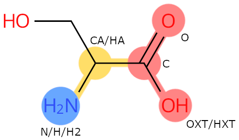
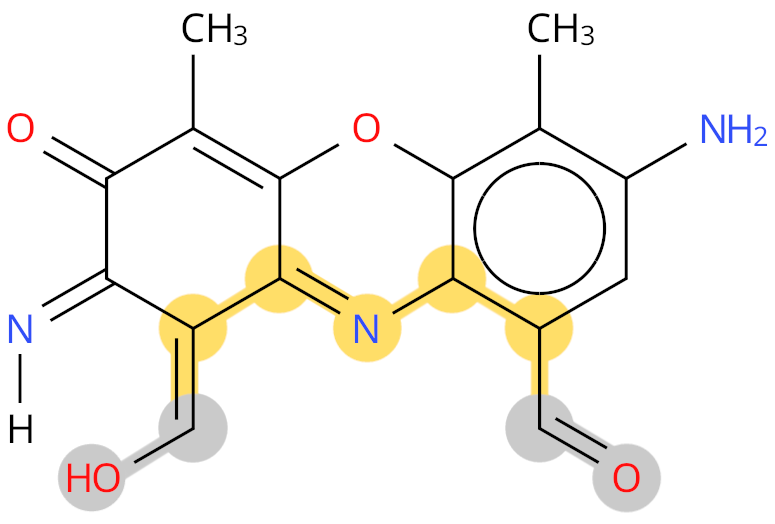
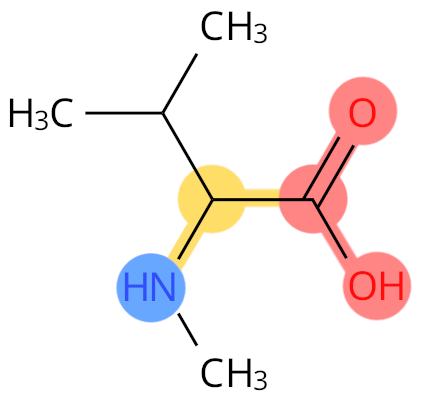
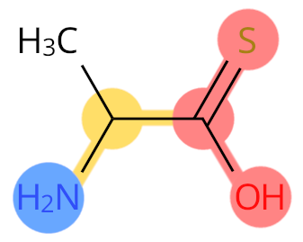
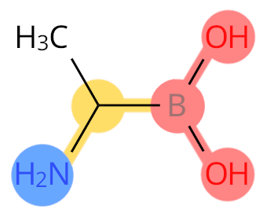
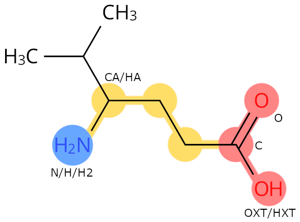
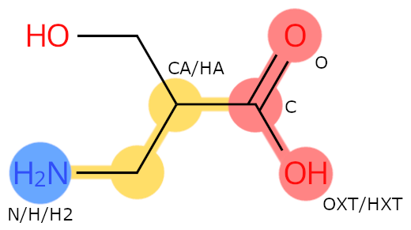
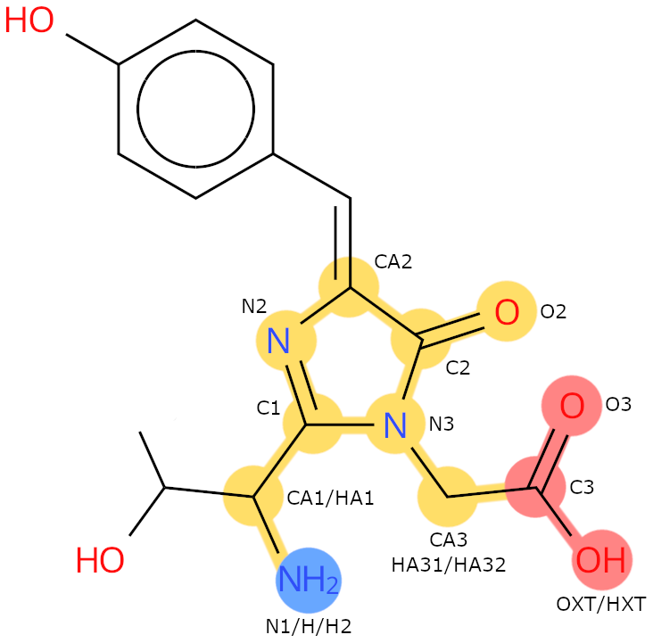

# Peptide Residues Remediation

As of July 2023, the PDB archive has no CCD data items to describe whether an atom 
within a peptide residue is part of the amino acid backbone or part of the N- or 
C-terminal groups of the peptide residue. In addition, amino acid CCDs do not yet have 
standardised atom naming for the backbone atoms, which makes it difficult to identify 
which atoms form the N- and C-terminal groups.

The Peptide Residues Remediation therefore focuses on addressing the following:
- Adding new CCD data items to label atoms that form the backbone, N- or C-terminal 
groups
- Standardising the atom naming of peptide backbone atoms

This will ensure that the backbone and terminal atoms are labelled in polypeptide 
residues, and that backbone atom names are standardised in polypeptide residue CCD 
files.

## Files affected by this remediation
- CCD files
- mmCIF model files
- PRD and PRD-CC files
- NMR chemical shift files, molecular restraints files, NMR combined str files

## Adding new CCD data items to label atoms that form the backbone, N- or C-terminal groups

The new CCD data items to flag the backbone and terminal groups of the peptide residues 
will be stored in three new mmCIF items to the CCD category _chem_comp_atom, as follows:
- pdbx_backbone_flag 

Is the atom part of the backbone of the peptide residue? 

| Accepted values |
|-----------------|
| Y               |
| N               |

- pdbx_n_terminal_atom_flag 

Is the atom an N-terminal atom in the peptide residue?

| Accepted values |
|-----------------|
| Y               |
| N               |
| .               | 

- pdbx_c_terminal_atom_flag 

Is the atom an C-terminal atom in the peptide residue? 

| Accepted values |
|-----------------|
| Y               |
| N               |
| .               | 

Example: SER. Colour legend: 
blue: N-terminal flag; 
red: C-terminal flag; 
yellow: backbone flag

## Rules for Backbone Flag 
The following rules have been used to populate the backbone flag for all existing backbone atoms: 

1. All atoms that lie between the N- and C-terminal groups should be labelled as backbone.
   - This is usually the shortest path between the two but there are exceptions (e.g. chromophores).
   - When the backbone is difficult to identify, it is chosen as the shortest path between the two termini.

Example: PX1. The shortest path between the two termini, and labelled as backbone, is 
shown in yellow. The grey colour shows ambiguous terminal groups.

2. All hydrogens linked to the backbone atoms are labelled as backbone.
3. All atoms in the backbone carboxyl group are labelled as backbone.
   - O, OXT and HXT 
4. Any atoms that are modifications to the backbone are not considered backbone atoms.

Example: MVA. The CN atom is not labelled as backbone.

## Rules for Terminal Atoms 
The following rules have been used to populate the N- and C-terminal flags: 

1. All atoms in the amino group and carboxyl group are considered terminal atoms. 
2. This includes oxygens and all hydrogens on these groups.
   - N-terminal are: N, H, H2
   - C-terminal are: C, O, OXT, HXT
3. In some rare cases, the terminal group is replaced by a very similar group. In these 
cases, where considered appropriate, the similar group should be labelled as terminal.

Example: ALT. Sulphur replaces the O atom, so it is labelled as C-terminal.

Example: B2A. Boron replaces C, so it is labelled as C-terminal.

4. In cases where it is ambiguous if the terminal group is N- or C-terminal, these atoms 
can be labelled with “.” for these items. 
   - Some non-standard residues contain two carboxyl or two amino groups rather than the 
   standard peptide backbone. In these cases it is ambiguous which terminal group is N- 
   or C-terminal and so both terminal groups should be labelled with “.” instead of Y 
   values. (e.g., PX1, see example image in previous section).

# Standardising the atom naming of peptide backbone atoms
## Rules for Atom Naming 
The following rules have been used to update the atom naming of all existing backbone 
atoms (excluding chromophores and capping residues, see below): 
1. The C-terminal linked carboxyl group should always be called C.
2. Where it has the full carboxyl group, the atoms should be called O/OXT/HXT (OXT and 
HXT being the leaving atoms).
3. The N-terminal linked amino group should always be called N.
   - Where it has one hydrogen only it should be called H.
   - Where it has two hydrogens, they should be called H/H2 (H2 being the leaving atom).
   - Where it has three hydrogens, they should be called H/H2/H3 (H2/H3 being the leaving atoms)
5. The backbone carbon with *both* an amino group and side chain should be called CA.

Example: 0JT. The carbon with both an amino group and a side chain is called CA.

5. When a carbon has an amino group, and another carbon has the side chain, then the 
carbon with the side chain should be CA.

Example: BSE. The carbon with the side chain is called CA, even if it is different from 
the carbon having the amino group.

7. No two atoms should have the same atom name.
8. Backbone hydrogen atom naming will not be fully standardised, except H/H2/H3/HXT.

In some cases, side chain atom naming was inconsistent or clashed with the new backbone 
atom names, and has therefore been updated to align with the new annotation rules.

# Additional information
## Updates to leaving atom flags 
During the remediation process, many CCDs were identified to have missing or incorrect 
leaving atoms on the backbone. It was particularly common that the N- or C-terminal 
leaving atoms were not assigned. As part of the remediation, all missing or incorrect 
leaving atoms on the backbone have been fixed.

## Rules for Chromophores
The annotation rules for chromophores and chromophore-like CCDs are slightly different 
to standard amino acid residues:
1. The N-terminal atoms should be called N1/H/H2.
2. The C-terminal carboxyl atoms should be called C3/O3/OXT/HXT.
3. Where possible, the backbone atom naming should match the CDD CRO.
4. The backbone atoms should be handled in the same way as standard peptides 
(excl. the shortest path rule).
5. However, it should also include all the atoms involved in the peptide bonds.
6. This means that the oxygens that form the peptide bonds should also be labelled as backbone.

Example: CRO. The backbone heavy atoms are:
N1, CA1, C1, N2, CA2, C2, O2, N3, CA3, C3, O3, OXT.

8. The terminal groups should be handled in the same way as standard peptides.
9. The N-terminal group should only be added for the first residue in the chromophore 
(i.e. on N1 not N2/N3 groups).
10. The C-terminal group should only be added for the last residue in the chromophore 
(i.e. on C3, not C1/C2 groups).
11. In rare cases, there are 4 not 3 residues in the chromophore. 
In these cases the atoms should be named:
    - N0, CA0, C0 etc. if the additional residue is on the N-terminus 
    - N4, CA4, C4 etc. if the additional residue is on the C-terminus 

## Rules for Terminal Cap Residues 
The annotation rules for N- and C-terminal cap residues CCDs are different to standard 
amino acid residues. These terminal caps are defined as: “Any CCD that only occurs on 
either the N- or C-terminal position of polypeptides and that does not have a standard 
amino acid backbone, but instead have a single group that connects them to the 
polypeptide sequence. This is usually a carboxyl group for N-terminal caps and an 
amino group for C-terminal caps.” 

The rules for annotating the backbone and terminal flags for these CCDs are: 
1. Only the atoms that are part of the group connecting the cap to the polypeptide 
backbone should be labelled as backbone.
   - For N-terminal caps, this will usually be the carboxyl group atoms.
   - For C-terminal caps, this will usually be the amino group atoms.
2. N-terminal caps have a C-terminal group but not an N-terminal group and so:
   - No atoms should be labelled as being N-terminal.
   - The atoms labelled as backbone should all be labelled as C-terminal.
3. C-terminal caps follow the same format, except they contain an N-terminal group but 
not a C-terminal group.
4. As these cap residues do not resemble standard amino acids, atom renaming has not 
been performed for these residues.

## List of CCDs and PRDs affected by this remediation
Full lists of the [CCDs](data/summaries/ccd_list.csv) and 
[PRDs](data/summaries/prd_list.csv) affected by this remediation are available.

## Acknowledgements
The peptide residues chemical component dictionary remediation project is part of the 
protein chemical modifications (PCMs) and post translational modifications (PTMs) 
remediation project, a wwPDB collaborative project carried out principally by 
[PDBe](https://www.ebi.ac.uk/pdbe/) at [EMBL-EBI](https://www.ebi.ac.uk/), and is funded 
by BBSRC grant number BB/V018779/1.
